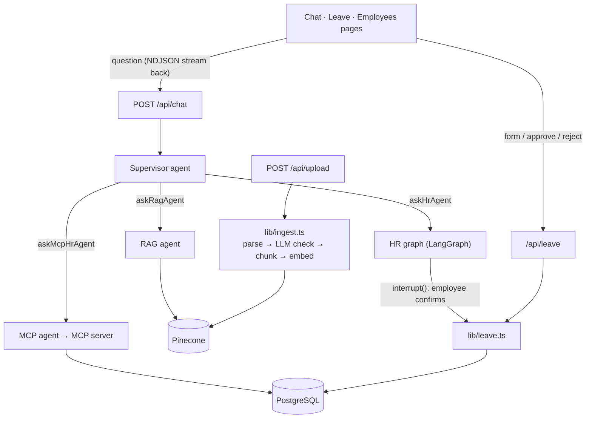

# PeopleDesk AI

[](https://github.com/Divya0499/peopledesk-ai/actions/workflows/ci.yml)

**[Live demo](https://peopledesk-ai.vercel.app)** · log in with any demo account below (password `PeopleDesk@123`)

An HR assistant for employees. You chat with it and ask things like *"How many leave days do I have?"*, *"What's the hotel limit on work trips?"* or *"Apply 2 days of leave for a doctor's appointment."*

Behind the chat there's a supervisor agent that decides who should answer: the company policy PDFs (RAG, with sources), the employee's own HR data, or the leave workflow, where the request goes to their manager for approval.

I started this as a "chat with a PDF" app to learn RAG, and kept adding to it: agents, the leave flow, login, tests and an eval.

**Stack:** Next.js 16, React 19, TypeScript, LangChain / LangGraph, Gemini, Pinecone, PostgreSQL + Prisma, MCP, Vitest, Playwright

## Features

- **Supervisor + specialist agents** – the supervisor sends each question to a RAG agent, an HR agent (a LangGraph graph) or an MCP-based agent. The answer streams back to the UI.
- **Leave requests with two approvals** – first the employee confirms in the chat (LangGraph `interrupt()`, saved in PostgreSQL so it survives a restart), then their manager approves or rejects it. Days are blocked when the request is made and returned if it's rejected or cancelled.
- **No double deductions** – the balance check and deduction are one conditional update in a transaction, and every request has an idempotency key, so double clicks, retries or parallel requests can't overdraw the balance. Tested against a real DB.
- **RAG with an eval** – retrieval, Gemini reranking, answers with sources, and a [31-question eval](#rag-evaluation).
- **Upload checks** – file type, size and scanned PDFs are rejected, and an LLM check keeps quotations, CVs, payslips etc. out of the knowledge base. Processing runs in the background.
- **Security** – password login (scrypt), rate limiting, roles, ownership checks, and prompt-injection handling.

## Demo accounts

Created by `npm run db:seed`, password `PeopleDesk@123`:

| Email | Role | What to try |
|---|---|---|
| `neha@peopledesk.dev` | Employee | Ask the assistant to apply leave, then check the **Leave** page |
| `vikram@peopledesk.dev` | Manager | Approve / reject on **Leave** |
| `asha@peopledesk.dev` | HR admin | Upload policy PDFs, add employees on **Employees** |

## Running locally

You need Node 20+, PostgreSQL, a Gemini API key and a Pinecone index (3072 dimensions, cosine).

```bash
npm install
cp .env.example .env         # add your keys
npx prisma migrate deploy
npm run db:seed
npm run dev
```

Other scripts: `npm test` (Vitest), `npm run test:e2e` (Playwright), `npm run eval:rag`, `npm run lint`, `npm run typecheck`.

Tests need a separate database whose name ends in `_test` (`TEST_DATABASE_URL` in `.env.test`).

## Architecture



## Leave flow

```text
Employee: "Apply 2 days of leave"
  → supervisor → askHrAgent → HR graph checks balance, calls applyLeave
  → interrupt(): Confirm / Cancel card in chat (nothing saved yet)
  → Confirm → 2 days blocked + pending request created
  → Manager on /leave: Approve (days stay deducted) or Reject (days come back)
  → Employee can cancel while it's pending (days come back)
```

If an employee has no manager, admins approve. No one can approve their own leave. Chat and the leave form both go through `lib/leave.ts`, so the rules are the same.

## RAG evaluation

`npm run eval:rag` indexes 3 policy docs into a temporary Pinecone namespace, runs [31 questions](tests/eval/dataset.json) through the RAG chain and scores them. One doc has a prompt injection in it to check the assistant doesn't follow it.

| Metric | Result |
|---|---|
| Answer accuracy (27 answerable questions) | 100% |
| Cited the right document | 100% |
| Said "couldn't find" for the 4 unanswerable ones | 100% |
| Ignored the injected instruction | yes |
| Latency p50 / p95 | 11.3s / 22.9s |

It's a small hand-written set, so it's mainly for catching regressions, not a real accuracy number.

## Known limitations / TODO

- Rate limits and the upload queue are in memory, so they're per server instance. Would need Redis / a job queue to scale.
- Gemini free tier (15 req/min) runs out fast since one answer takes 4–6 model calls.
- Leave is a number of days for now, no date range yet.
